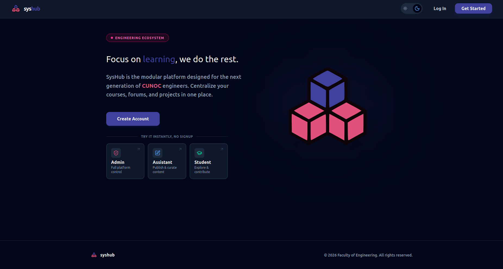
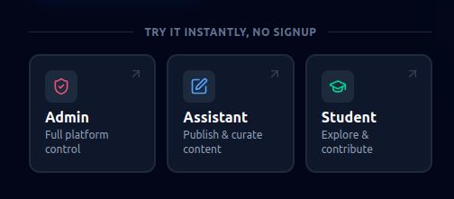
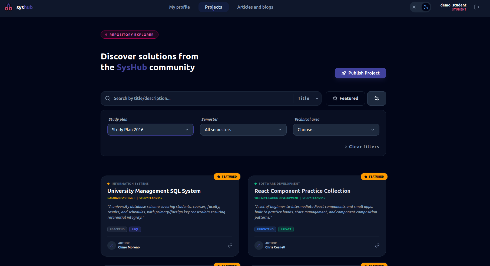
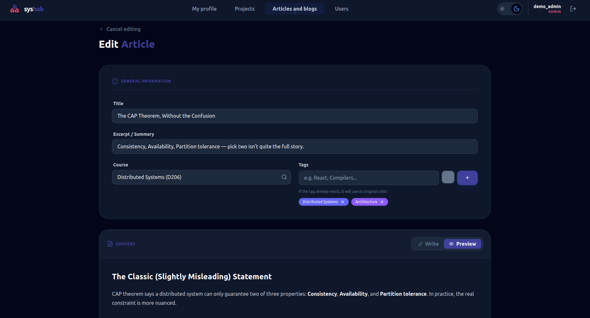

# SysHub — Frontend

React client for SysHub, an academic social platform built for the Computer Science and Systems Engineering program at USAC (CUNOC). Students, teaching assistants, and admins share projects, publish technical articles, and browse the academic course catalog.

**Live app:** [https://syshub.netlify.app](https://syshub.netlify.app)
**Backend repo & API docs:** [syshub-backend](https://github.com/cristian-ves/syshub-backend)



---

## Try it live

No account needed — the login page has one-click demo access for all three roles:

| Role      | Username         | Password   |
| --------- | ---------------- | ---------- |
| Admin     | `demo_admin`     | `password` |
| Assistant | `demo_assistant` | `password` |
| Student   | `demo_student`   | `password` |

> The backend runs on a free-tier server that spins down when idle. The first request can take up to a minute to wake up — the app shows a loading overlay while this happens.



---

## Features

-   **Role-based UI**: Student, Assistant, and Admin each see a different set of actions and pages
-   **Project repository**: browse, filter (by study plan, semester, technical area, tag, or course), and submit projects with GitHub links and file attachments
-   **Article platform**: Markdown-based articles with live write/preview toggle, comments, upvote/downvote, and a personal favorites collection
-   **Admin dashboard**: create and manage user accounts, including role and password resets
-   **Dark mode** with system preference detection and persistence
-   **Responsive design**, from mobile to desktop
-   **Cold-start aware**: a connection overlay informs the user when the backend is waking up, instead of leaving them looking at a frozen screen





---

## Tech Stack

| Category           | Technology            |
| ------------------ | --------------------- |
| Framework          | React 19 + TypeScript |
| Build tool         | Vite                  |
| Routing            | React Router v7       |
| State management   | Redux Toolkit         |
| Forms & validation | React Hook Form + Zod |
| HTTP client        | Axios                 |
| Styling            | Tailwind CSS v4       |
| Markdown rendering | react-markdown        |
| Icons              | lucide-react          |
| Notifications      | Sonner                |

---

## Project Structure

```
src/
├── api/                  # Axios instance, interceptors, connection tracking
├── components/
│   ├── common/            # Reusable, cross-feature components
│   └── layout/             # Navbar, Footer, route layouts
├── features/
│   ├── auth/
│   ├── articles/
│   ├── projects/
│   ├── admin/
│   └── profile/
│       ├── components/
│       ├── schemas/        # Zod validation schemas
│       └── services/        # API calls for that feature
├── hooks/                 # Shared hooks (useAuth, useCreateProject, etc.)
├── pages/                 # Route-level components, grouped by feature
├── routes/                # Router config, ProtectedRoute, AdminRoute, PublicRoute
└── store/
    └── slices/              # Redux Toolkit slices
```

---

## Environment Variables

Create a `.env` file in the project root:

```
VITE_API_URL=http://localhost:8080/api/v1
```

For local development, point this at your locally running [syshub-backend](https://github.com/cristian-ves/syshub-backend) instance. For production, it points at the deployed Render URL.

---

## Local Setup

**Requirements:** Node.js, and the [syshub-backend](https://github.com/cristian-ves/syshub-backend) running locally or accessible remotely.

```bash
git clone https://github.com/cristian-ves/syshub-frontend.git
cd syshub-frontend
npm install

# Create .env with VITE_API_URL pointing to your backend

npm run dev
```

The app will be available at `http://localhost:5173`.

---

## Deployment

Deployed on [Netlify](https://netlify.com) as a static SPA, with a `_redirects` rule (`/* /index.html 200`) so client-side routes resolve correctly on direct navigation and page refresh.

```bash
npm run build   # outputs to dist/
```

---

## Related Repository

Backend source and full API documentation: [syshub-backend](https://github.com/cristian-ves/syshub-backend)

---

## Author

**Cristian Vásquez** — Systems Engineering student at USAC CUNOC, Guatemala

<!-- portfolio link here once deployed -->
